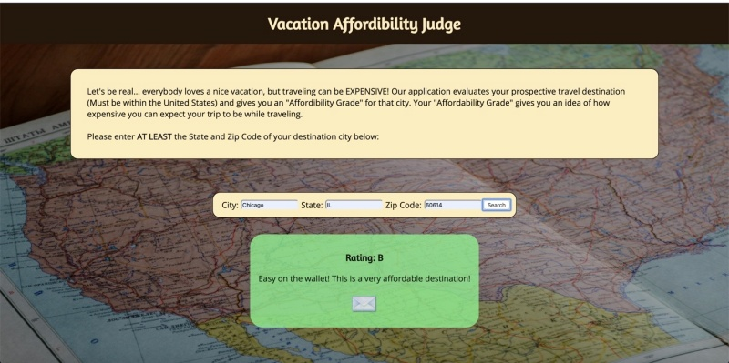

<h1>Vacation Affordibility Judge</h1>

<h2>Summary</h2>

Vacation Affordibility Jugde allows users to search for their prospective destination city, and receive an "Affordibility Grade" for that city.
 

<h2>Technologies Used</h2>
<ul>
<li>HTML</li>
<li>CSS</li>
<li>jQuery</li>
<li>JavaScript</li>
</ul

<h2>Demo</h2>
<a href='https://ctmq75.github.io/Vacation-Affordibility-Judge/'>Live App</a>
